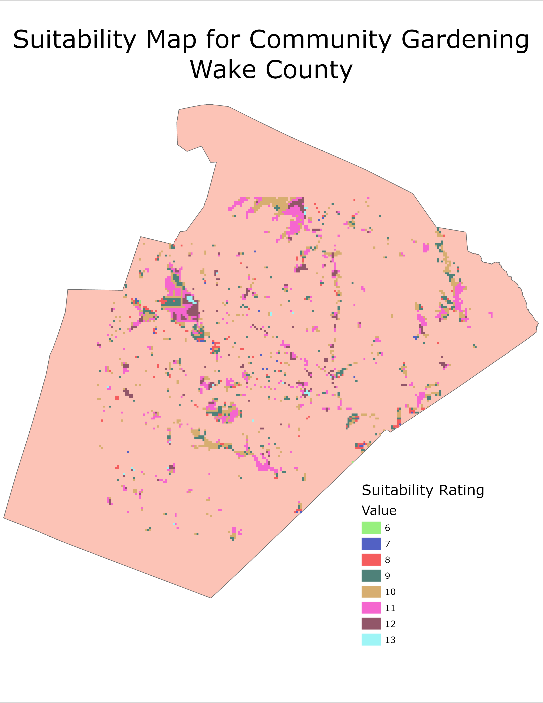

```{r setup, eval=FALSE, include=FALSE}
knitr::opts_chunk$set(echo = TRUE)


library(reticulate)
```
### Objective

Generate a suitability analysis map of Wake County, NC for community gardens

### Project Report
{width=100% height=800}

### Code
```{python eval=FALSE}
import arcpy
import os
from arcpy.sa import *
from arcpy.ia import *

#############################
### Workspace Setup
#############################
os.chdir("..")
print(os.path.abspath(os.curdir))

# make workspace
arcpy.env.workspace = "\\."
print("current workspace", arcpy.env.workspace)

# To allow overwriting outputs change overwriteOutput option to True.
arcpy.env.overwriteOutput = True


#######################
### Zoning Classification
######################

# create fucntion to classify each zoning area
def zoneClassify(shpf):
    # create new field to store 0/1 values that mark if zoneing class is correct
    # for CG
    arcpy.AddField_management(shpf, "CGZone", "SHORT")

    # create update cursor to create label each zone 0/1 based on suitibility for CG
    with arcpy.da.UpdateCursor(shpf, ["CLASS", "CGZone"]) as zoneClassCursor:
        for row in zoneClassCursor:
            # residential districts suitable for CG overall; res. districts start with "R"
            if row[0].startswith("R") == True:
                row[1] = 1
            else:
                row[1] = 0
            # update cursor with updated list
            zoneClassCursor.updateRow(row)

    
# create search cursor for Raleigh because does not have CLASS field
arcpy.AddField_management(".\\data\\Zoning\\Raleigh_Zoning.shp", "CGZone", "SHORT")
zoneList = ["R-1", "R-2", "R-4", "R-6", "R-10", "AP", "MH", "RX", "OX", "IX", "OP", "NX", "CX", "DX"]
with arcpy.da.UpdateCursor(".\\data\\Zoning\\Raleigh_Zoning.shp", ["ZONE_TYPE", "CGZone"]) as zoneClassCursor2:
    for row in zoneClassCursor2:
        # check each zone against the specific zones Raleigh laid out for CG suitibility
        if row[0].startswith(tuple(zoneList)) == True:
            row[1] = 1
        else:
            row[1] = 0
        # update cursor with updated list
        zoneClassCursor2.updateRow(row)

    
# create search cursor for Wakeforest because does not have CLASS field
arcpy.AddField_management(".\\data\\Zoning\\Wake_Forest_Zoning.shp", "CGZone", "SHORT")
with arcpy.da.UpdateCursor(".\\data\\Zoning\\Wake_Forest_Zoning.shp", ["ZoneClass", "CGZone"]) as zoneClassCursor3:
    for row in zoneClassCursor3:
        # check each zone against the specific zones Raleigh laid out for CG suitibility
        if row[0].startswith("R") == True:
            row[1] = 1
        else:
            row[1] = 0
        # update cursor with updated list
        zoneClassCursor3.updateRow(row)

# create list of files to loop through function with                   
cities = ["Wake_County", "Apex", "Cary", "Fuquay-Varina", "Garner", "Holly_Springs", "Knightdale", "Morrisville", "Rolesville", "Wendell", "Zebulon"]

# loop through each city's zoning file
for city in cities:
    # create file name for each city
    cityFile = ".\\data\\Zoning\\" + city + "_Zoning.shp"
    # call zoneClassify function
    zoneClassify(cityFile)

#######################
### Park Classification
######################

# define function to classify Open_Space dataset
def parkClassify(shpf):
    # create new field to store 0/1 values that mark if park
    arcpy.AddField_management(shpf, "CGZone", "SHORT")

    # create update cursor to create label each zone 0/1 based on suitibility for CG
    with arcpy.da.UpdateCursor(shpf, ["TYPE", "CGZone"]) as parkCursor:
        for row in parkCursor:
            # residential districts suitable for CG overall; res. districts start with "R"
            if row[0] == "PARK":
                row[1] = 1
            else:
                row[1] = 0
            # update cursor with updated list
            parkCursor.updateRow(row)

# classify park layer
parkClassify(".\\data\\Open_Space\\Open_Space.shp")

#####################################
### Rasterize Zoning, Parks, and WCL
####################################

# create function to raterize zoning and parks layers   
def rasterizeZoningParks(shpf):
    # retrieve file name for raster output file name
    cityFile = os.path.split(shpf)
    # cut down characters in file name to avoid ERROR 000878 (grid name longer than 13)
    nCF = cityFile[1]
    # take of ending to edit for output file name
    cf = nCF[0:4]
    # specify output file name for each shpf
    outName = ".\\output\\ZoningRastFINAL\\" + cf + "Rst"
    # rasterize feature layer
    arcpy.conversion.FeatureToRaster(shpf, "CGZone", outName)

# create list of files to loop through function with                   
cities = ["Apex", "Cary", "Fuquay-Varina", "Garner", "Holly_Springs", "Knightdale", "Morrisville", "Rolesville", "Wendell", "Zebulon", "Wake_Forest", "Raleigh"]

# loop through each city's zoning file
for city in cities:
    # create file name for each city
    cityFile = ".\\data\\Zoning\\" + city + "_Zoning.shp"
    # call rasterizeZoningParks function
    rasterizeZoningParks(cityFile)

# rasterize wake county line for no data areas
arcpy.conversion.FeatureToRaster(".\\data\\WakeCountyLine\\Wake_County_Line.shp", "FTR_CODE", ".\\output\\WCLRastFINAL\\WCLNoDatRst")

# rasterize park layer
arcpy.conversion.FeatureToRaster(".\\data\\Open_Space\\Open_Space.shp", "CGZone", ".\\output\\ParkRastFINAL\\ParkRst")

################################
### Land Raster Mosaic and Merge
################################
    
# initialize list of raster files
rastFiles = []
#assign directory
directory = ".\\output\\ZoningRastFINAL"
# use loop to create lsit of raster files in directory
for filename in os.listdir(directory):
    f = os.path.join(directory, filename)
    rastFiles.append(f)

# merge zoning rasters
arcpy.MosaicToNewRaster_management(rastFiles, ".\\output\\ZoningRastFINAL", "TestRastMos", "", "", "", 1)

# reclassify wake county line raster to reflect no data
WCLReclass = Reclassify(".\\output\\WCLRastFINAL\\WCLNoDatRst", "VALUE", RemapValue([[0, 99999]]))
WCLReclass.save(".\\output\\WCLRastFINAL\\WCLNoDatRstRe")

# merge wake county line raster and zoning mozaic raster
landRast = arcpy.ia.Merge([".\\output\\ZoningRastFINAL\\TestRastMos", "..\\output\\WCLRastFINAL\\WCLNoDatRstRe"], "FIRST")
landRast.save(".\\output\\LandRastFINAL\\landRast")

######################################
### Euclidean Distance Feature Layers
######################################

roadsED = EucDistance(".\\data\\RoadsWC\\RoadsWC.shp")
roadsED.save(".\\output\\EDRastFINAL\\RoadsED")
print("roadsED completed.")

lakesED = (".\\data\\LakesPonds\\LakesPonds.shp")
lakesED.save(".\\output\\EDRastFINAL\\LakesED")
print("lakesED completed.")

riversED = EucDistance("..\\data\\Hydrolines\\hydrolines.shp")
riversED.save("..\\output\\EDRastFINAL\\RiversED")
print("riversED completed.")

schoolsED = EucDistance("..\\data\\WCSchools\\WCSChools.shp")
schoolsED.save("..\\output\\EDRastFINAL\\SchoolsED")
print("schoolsED completed.")

librariesED = EucDistance("..\\data\\Libraries\\Libraries.shp")
librariesED.save("..\\output\\EDRastFINAL\\LibrariesED")
print("librariesED completed.")

######################################
### Reclassify Euclidean Distance Layers
######################################

# Reclassify each feature layer's euclidean distance
RoadsED = Reclassify(".\\output\\EDRastFINAL\\RoadsED", "VALUE", 
                         RemapRange([[1001,86239.2,1],[0,1000,0]]))
RoadsED.save(".\\output\\EDRastRecFINAL\\RoadsEDRe")


RiversED = Reclassify(".\\output\\EDRastFINAL\\RiversED","VALUE", 
                         RemapRange([[4801,,0],[3601,4800,1], [2401,3600,2], [1201,2400,3],[0,1200,4]]))
RiversED.save(".\\output\\EDRastRecFINAL\\RiversEDRe")


LakesED = Reclassify(".\\output\\EDRastFINAL\\LakesPondsED","VALUE", 
                         RemapRange([[4801,,0],[3601,4800,1], [2401,3600,2], [1201,2400,3],[0,1200,4]]))
LakesED.save(".\\output\\EDRastRecFINAL\\LakPonEDRe") 


SchoolsED = Reclassify(".\\output\\EDRastFINAL\\SchoolsED","VALUE", 
                         RemapRange([[10561,,0],[0,10560,1]])
SchoolsED.save(".\\output\\EDRastRecFINAL\\SchoolsEDRe")


LibrariesED = Reclassify(".\\output\\EDRastFINAL\\LibrariesED", "VALUE", 
                         RemapRange([[10561,,0],[0,10560,1]]))
LibrariesED.save(".\\output\\EDRastRecFINAL\\LibrariesEDRe")  


######################################
### Add All Raster Layers
######################################

# create variable for each raster file
zoning = Raster(".\\output\\LandRastFINAL\\landRast")
parks = Raster(".\\output\\ParkRastFINAL\\ParkRst")
roads = Raster(".\\output\\EDRastRecFINAL\\RoadsEDRe")
rivers = Raster(".\\output\\EDRastRecFINAL\\RiversEDRe")
lakesPonds = Raster(".\\output\\EDRastRecFINAL\\LakPonEDRe")
schools = Raster(".\\output\\EDRastRecFINAL\\SchoolsEDRe")
libraries = Raster(".\\output\\EDRastRecFINAL\\LibrariesEDRe")

# add raster layers to create suitibiltiy analysis raster
cgSuitRast = zoning + parks + roads + rivers + lakesPonds + schools + libraries
cgSuitRast.save(".\\output\\SuitibilityFINAL\\CGSuitRast")


```

### Resulting Map

{width=50%}