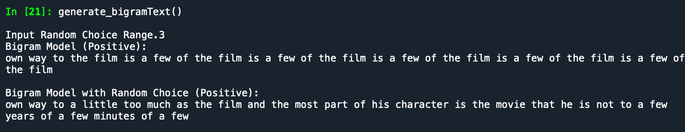
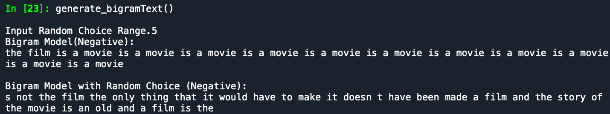
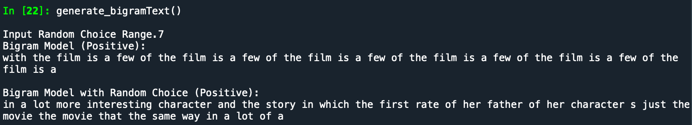
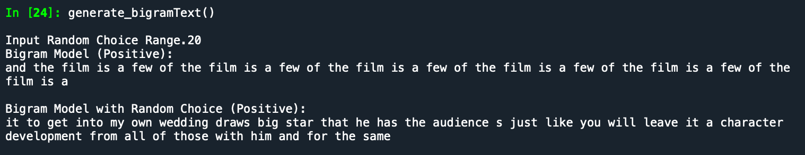
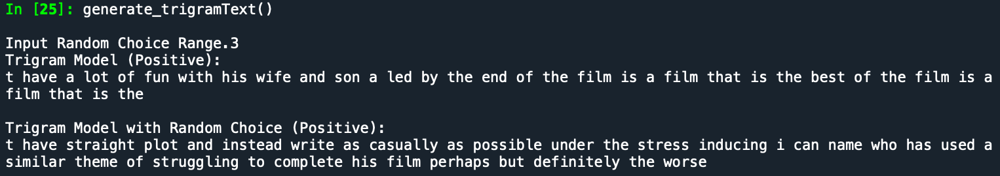
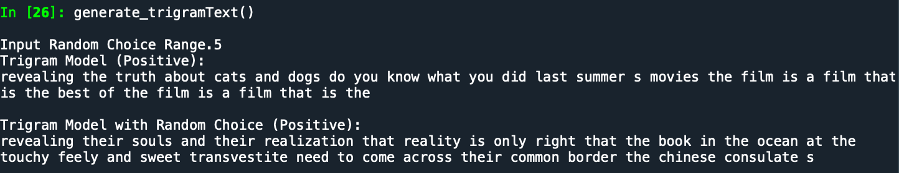
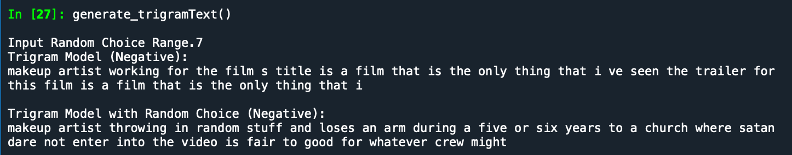
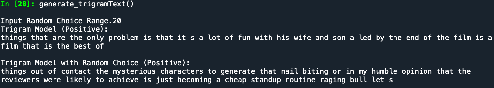

```{r setup, eval=FALSE, include=FALSE}
knitr::opts_chunk$set(echo = TRUE)


library(reticulate)
```
### Objective

Generate positive and negative movie reviews using NLTK's tagged movie review corpus and the n-gram model. Improve on the repetition problems in the original bigram model.

### Code
```{python eval=FALSE}
import nltk
import random
from nltk import bigrams
from nltk import ngrams
from nltk.corpus import movie_reviews

#Creates separate lists of positively tagged and negatively tagged texts
positiveText = [word.lower() for fileid in movie_reviews.fileids() if fileid[:3] == 'pos' for word in movie_reviews.words(fileid) if word.isalpha()]
negativeText = [word.lower() for fileid in movie_reviews.fileids() if fileid[:3] == 'neg' for word in movie_reviews.words(fileid) if word.isalpha()]

#Creates bigrams for both positive and negative texts
posBigrams = list(bigrams(positiveText))
negBigrams = list(bigrams(negativeText))

#Calculates Frequency Distribution of positive and negative bigrams and generates list of (bigram, count) pairs
pos_biCount = nltk.FreqDist(posBigrams).most_common()
neg_biCount = nltk.FreqDist(negBigrams).most_common()

#Conditional Frequency Distribution of positive and negative bigrams
posBi_cfd = nltk.ConditionalFreqDist(posBigrams)
negBi_cfd = nltk.ConditionalFreqDist(negBigrams)

#Creates trigrams for both positive and negative texts
posTrigrams = list(ngrams(positiveText, 3))
negTrigrams = list(ngrams(negativeText, 3))

#Calculates Frequency Distribution of positive and negative bigrams and generates list of (trigram, count) pairs
pos_triCount = nltk.FreqDist(posTrigrams).most_common()
neg_triCount = nltk.FreqDist(negTrigrams).most_common()

#Creates fourgrams for both positive and negative texts
posFourgrams = list(ngrams(positiveText, 4))
negFourgrams = list(ngrams(negativeText, 4))

pos_fourCount = nltk.FreqDist(posFourgrams).most_common()
neg_fourCount = nltk.FreqDist(negFourgrams).most_common()


#Generates text using bigrams
def bigram_model(bgrdist, word, num=35):
    text = []
    for i in range(num):
        word = bgrdist[word].max()
        text.append(word)
    return " ".join(text)
 
#Generates text using bigrams with more variability because chooses from top 5 most frequent words
def bigram_model2(bgrdist, word, rdm, num=35):
    text = []
    for i in range(num):
        #Use random choice so generatior does not get stuck on same sequence of words
        wordList = [w for (w, freq) in bgrdist[word].most_common(rdm)]
        word = random.choice(wordList)
        text.append(word)
    return " ".join(text)
        
#Generates text using trigrams
def trigram_model(bgrdist, bgrfreq, tgrfreq, word, num=35):
    text = []
    #Append input word to text
    text.append(word)
    #Use bigram conditional frequency distribution to find second word for text
    w2 = bgrdist[word].max()
    text.append(w2)
    #Reduce words left to generate by number of words already in text
    num = num-2
    #Generate remaining words using trigrams
    for i in range(num):
        #Create bigram using last two words of text
        bgr = (text[-2], text[-1])
        #Extract count of bgr in corpus from bigram frequency distribution
        bgrCountExtract = [bigr[1] for bigr in bgrfreq if bigr[0] == bgr]
        #Assign bigram count to variable; want number to remain not list
        bgrCount = bgrCountExtract[0]
        #Create list of (trigram, trigram probability) pairs for each trigram in the trigram frequency distribution
        #tgr[0] = trigram string; tgr[1] = trigram count in corpus; 
        #(tgr[1]/bgrCount) returns trigram probability of --> "w1 w2 w3"  where P(w3|w1 w2) = ("w1 w2 w3"/ "w1 w2")
        triProbs = [(tgr[0], (tgr[1]/bgrCount)) for tgr in tgrfreq if tgr[0][:2] == bgr]
        #Find the highest probability to determine what w3 should be and return the the last word in the trigram 
        new_word = max(triProbs, key=lambda item:item[1])[0][2]
        #Add newest word to text
        text.append(new_word)
    #At end of loop return words in text as string
    return " ".join(text)

#Generates text using trigrams with more variability because chooses from top 5 most frequent words
def trigram_model2(bgrdist, bgrfreq, tgrfreq, word, rdm, num=35):
    text = []
    #Append input word to text
    text.append(word)
    #Use bigram conditional frequency distribution to most frequent words after w1
    w2_list = [w for (w, freq) in bgrdist[word].most_common(rdm)]
    #Use random choice to choose w2 from most frequent so generator does not get stuck on same sequence of words
    w2 = random.choice(w2_list)
    text.append(w2)
    #Reduce words left to generate by number of words already in text
    num = num-2
    for i in range(num):
        #Create bigram using last two words of text
        bgr = (text[-2], text[-1])
        #Extract count of bgr in corpus from bigram frequency distribution
        bgrCountExtract = [bigr[1] for bigr in bgrfreq if bigr[0] == bgr]
        #Assign bigram count to variable; want number to remain not list
        bgrCount = bgrCountExtract[0]
        #Create list of (trigram, trigram probability) pairs for each trigram in the trigram frequency distribution
        #tgr[0] = trigram string; tgr[1] = trigram count in corpus; 
        #(tgr[1]/bgrCount) returns trigram probability of --> "w1 w2 w3"  where P(w3|w1 w2) = ("w1 w2 w3"/ "w1 w2")
        triProbs = [(tgr[0], (tgr[1]/bgrCount)) for tgr in tgrfreq if tgr[0][:2] == bgr]
        #Sort (trigram, probability) pairs in triProbs by highest probability to lowest probabillity and return list of top 5 highest probability
        top_triProb = sorted(triProbs, key = lambda feature: feature[1])
        #Create extract final word from each trigram in (trigram, probability) pair in top_triProb and create list of word choices 
        wrd_choices = [tri[0][2] for tri in top_triProb[:rdm]]
        #Use random choice to choose word from wrd_choices
        new_word = random.choice(wrd_choices)
        #Add newest word to text
        text.append(new_word)
    #At end of loop return words in text as string
    return " ".join(text)


def tgr_cfd(tgrlist):
    condition_pairs = [((w1, w2), w3) for (w1, w2, w3) in tgrlist]
    cfd = nltk.ConditionalFreqDist(condition_pairs)
    return cfd


#Generate text to compare bigram, trigram, and fourgram models with and without random choice
def generate_bigramText():
    #Choose Category Randomly
    category = random.choice(['pos', 'neg'])
    if category == 'pos':
        #Choose input word randomly according to category
        word = random.choice(positiveText)
        rdm = int(input("Input Random Choice Range."))
        print("Bigram Model (Positive):")
        print(bigram_model(posBi_cfd, word))
        print("\nBigram Model with Random Choice (Positive):")
        print(bigram_model2(posBi_cfd, word, rdm))       
    else:
        #Choose input word randomly according to category
        word = random.choice(negativeText)
        rdm = int(input("Input Random Choice Range."))
        print("Bigram Model(Negative):")
        print(bigram_model(negBi_cfd, word))
        print("\nBigram Model with Random Choice (Negative):") 
        print(bigram_model2(negBi_cfd, word, rdm))

def generate_trigramText():
    #Choose Category Randomly
    category = random.choice(['pos', 'neg'])
    if category == 'pos':
        #Choose input word randomly according to category
        word = random.choice(positiveText)
        rdm = int(input("Input Random Choice Range."))
        print("Trigram Model (Positive):")
        print(trigram_model(posBi_cfd, pos_biCount, pos_triCount, word))
        print("\nTrigram Model with Random Choice (Positive):")
        print(trigram_model2(posBi_cfd, pos_biCount, pos_triCount, word, rdm))
    else:
        #Choose input word randomly according to category
        word = random.choice(negativeText)
        rdm = int(input("Input Random Choice Range."))
        print("Trigram Model (Negative):")
        print(trigram_model(negBi_cfd, neg_biCount, neg_triCount, word))
        print("\nTrigram Model with Random Choice (Negative):")
        print(trigram_model2(negBi_cfd, neg_biCount, neg_triCount, word, rdm))


generate_bigramText()
generate_bigramText()
generate_trigramText()
generate_trigramText()

```

### Results

Randomization was used to get rid of the repetition problem in the original bigram model. Both the Trigram and Bigram models were run using differnt levels of randomization.

Each example shows with and without randomization.

##### Bigrams





##### Trigrams



